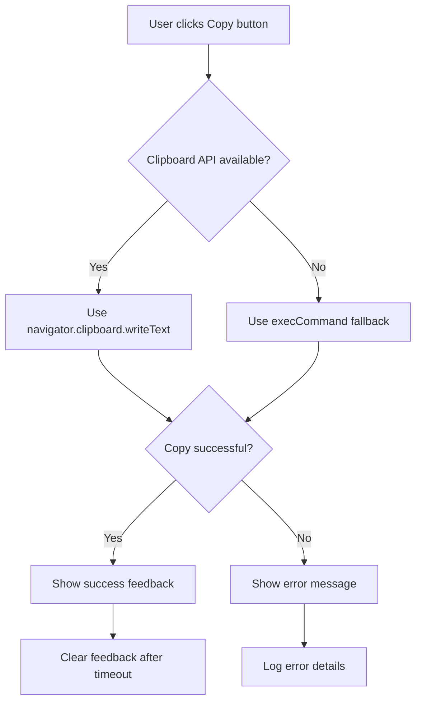

# Copy to Clipboard Feature Implementation Plan

## Current State

The copy-to-clipboard feature is already implemented in [`static/index.html`](static/index.html) (lines 81-105) using the modern Clipboard API (`navigator.clipboard.writeText()`). However, it lacks:

- Test coverage
- Fallback mechanisms for older browsers
- Enhanced error handling
- Accessibility features

## Implementation Tasks

### 1. Add Fallback Clipboard Implementation

**File**: [`static/index.html`](static/index.html)

The current implementation relies solely on the Clipboard API, which may not be available in:

- Older browsers
- Non-HTTPS contexts (though localhost is typically allowed)
- Some security-restricted environments

**Implementation**:

- Add a fallback function using the legacy `document.execCommand('copy')` method
- Detect Clipboard API availability and use fallback when needed
- Ensure both methods handle errors gracefully

**Code location**: Update the copy button event listener (around line 81)

### 2. Enhance Error Handling

**File**: [`static/index.html`](static/index.html)

**Improvements**:

- Provide more specific error messages based on failure type
- Handle permission denials gracefully
- Add console logging for debugging
- Consider showing error feedback in the UI instead of just alerts

**Code location**: Enhance the catch block in the copy event listener (around line 101)

### 3. Add Browser Compatibility Checks

**File**: [`static/index.html`](static/index.html)

**Implementation**:

- Check for Clipboard API support before attempting copy
- Provide user-friendly messages if clipboard operations aren't supported
- Consider disabling the copy button if clipboard is unavailable

### 4. Improve User Feedback

**File**: [`static/index.html`](static/index.html) and [`static/style.css`](static/style.css)

**Enhancements**:

- Add different feedback states (success, error, copying)
- Consider adding a loading state during copy operation
- Improve visual feedback animations
- Add keyboard accessibility (Enter key support on copy button)

### 5. Add Integration Tests

**File**: Create `handlers_test.go` additions or new test file

**Test Cases**:

- Verify copy button exists in HTML response
- Verify copy button has correct attributes and event handlers
- Test that copy functionality JavaScript is present
- Verify error handling code exists

**Note**: Full clipboard API testing requires browser automation (e.g., Playwright/Selenium), which may be beyond current test scope. Focus on verifying the HTML/JS structure.

### 6. Add Accessibility Features

**File**: [`static/index.html`](static/index.html)

**Improvements**:

- Add `aria-label` to copy button for screen readers
- Add `aria-live` region for copy feedback
- Ensure keyboard navigation works properly
- Add focus management after copy operation

## Implementation Flow

## Files to Modify

1. **`static/index.html`** - Enhance copy functionality with fallbacks and better error handling
2. **`static/style.css`** - Add styles for error states and improved feedback
3. **`handlers_test.go`** - Add tests to verify copy button and JavaScript presence

## Testing Strategy

Since clipboard operations require browser APIs, focus on:

1. **Unit tests**: Verify HTML structure and JavaScript presence
2. **Manual testing**: Test in multiple browsers (Chrome, Firefox, Safari, Edge)
3. **Fallback testing**: Test with Clipboard API disabled (via browser flags)
4. **Error scenario testing**: Test with clipboard permissions denied

## Success Criteria

- Copy functionality works in modern browsers (Chrome, Firefox, Safari, Edge)
- Fallback mechanism works in older browsers
- Clear error messages when copy fails
- Accessible to screen readers and keyboard navigation
- Visual feedback is clear and informative
- Tests verify HTML/JS structure

## Notes

- The Clipboard API requires a secure context (HTTPS or localhost)
- `document.execCommand('copy')` is deprecated but still widely supported as fallback
- Consider adding a "Select All" button as an alternative for users who can't copy
