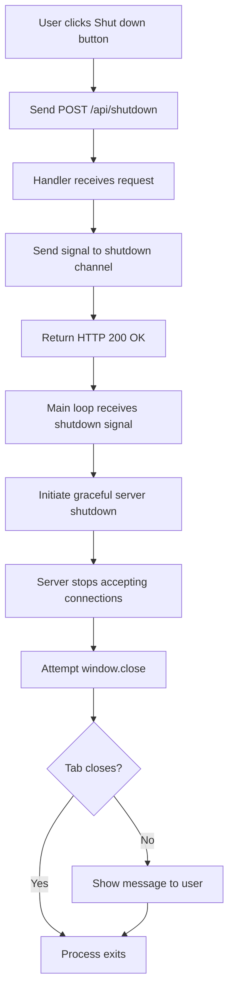

# Shut Down Button Implementation Plan

## Overview

Add a "Shut down" button to the web interface that allows users to gracefully stop the web server and close the browser tab from within the application.

## Current State

The application currently:
- Starts an HTTP server on a configurable port (default 8080)
- Automatically opens the browser to the server URL
- Handles graceful shutdown via SIGINT/SIGTERM signals (Ctrl+C)
- Uses a channel-based signal mechanism for shutdown

## Requirements

1. Add a "Shut down" button to the web interface
2. When clicked, send a request to the server to initiate shutdown
3. Server should gracefully shut down (same as Ctrl+C behavior)
4. Browser tab should close after shutdown (with fallback messaging if browser security prevents it)

## Implementation Tasks

### 1. Add Shutdown Channel to main.go

**File**: [`main.go`](main.go)

**Changes**:
- Create a shutdown channel that can be triggered from HTTP handlers
- Modify the main loop to listen for both signal-based shutdown (existing) and HTTP-triggered shutdown (new)
- Ensure graceful shutdown works the same way regardless of trigger source

**Code location**: 
- Add `shutdownChan := make(chan os.Signal, 1)` or similar channel
- Modify signal handling to also listen to HTTP-triggered shutdown
- Use `select` statement to handle both signal and HTTP shutdown

### 2. Add Shutdown Handler

**File**: [`handlers.go`](handlers.go)

**Changes**:
- Add `handleShutdown()` function that accepts POST requests to `/api/shutdown`
- Handler should:
  - Validate request method (POST only)
  - Send shutdown signal to the shutdown channel
  - Return success response before server shuts down
  - Handle concurrent shutdown requests gracefully

**Implementation considerations**:
- Use a sync.Once or similar mechanism to ensure shutdown is only triggered once
- Return HTTP 200 OK response before initiating shutdown
- Log shutdown request for debugging

### 3. Register Shutdown Route

**File**: [`main.go`](main.go)

**Changes**:
- Register new route: `mux.HandleFunc("/api/shutdown", handleShutdown)`
- Pass shutdown channel to handler (via closure or handler context)

**Code location**: Around line 28-30 where other routes are registered

### 4. Add Shut Down Button to HTML

**File**: [`static/index.html`](static/index.html)

**Changes**:
- Add a "Shut down" button below the copy button or at the bottom of the page
- Style it distinctly (e.g., red/destructive color) to indicate it's a shutdown action
- Add appropriate accessibility attributes (`aria-label`, etc.)

**Placement**: After the result section, before closing `</main>` tag

### 5. Add JavaScript Handler

**File**: [`static/index.html`](static/index.html)

**Changes**:
- Add event listener for shutdown button click
- Send POST request to `/api/shutdown` endpoint
- Show user feedback (e.g., "Shutting down...")
- Attempt to close browser tab using `window.close()`
- Handle case where browser prevents tab closing (show message to user)

**Implementation**:
```javascript
// Attempt to close tab (may be blocked by browser security)
window.close();

// If tab doesn't close, show message
setTimeout(() => {
    if (!document.hidden) {
        alert('Server has been shut down. Please close this tab manually.');
    }
}, 1000);
```

### 6. Style Shut Down Button

**File**: [`static/style.css`](static/style.css)

**Changes**:
- Add styles for shutdown button with distinct appearance (e.g., red gradient)
- Add hover and active states
- Ensure it's visually distinct from other buttons
- Consider adding a confirmation dialog style or visual indicator

**Styling considerations**:
- Use red/destructive color scheme to indicate shutdown action
- Make it clear this is a destructive action
- Ensure good contrast and accessibility

### 7. Add Tests

**File**: [`handlers_test.go`](handlers_test.go)

**Test Cases**:
- `TestHandleShutdown`: Verify shutdown endpoint accepts POST requests
- `TestHandleShutdownMethodNotAllowed`: Verify other HTTP methods are rejected
- `TestHandleShutdownTriggersShutdown`: Verify shutdown channel receives signal
- `TestShutdownButtonExists`: Verify shutdown button exists in HTML
- `TestShutdownButtonJavaScript`: Verify JavaScript handler is present

**Note**: Testing actual server shutdown in unit tests requires careful handling to avoid test interference.

## Implementation Flow



## Technical Considerations

### Browser Security Limitations

Modern browsers prevent JavaScript from closing tabs that were not opened by JavaScript. Since the browser is opened by the Go application using `open`/`xdg-open`/`cmd`, the tab may not be closeable via `window.close()`.

**Solutions**:
1. Attempt `window.close()` - works if browser allows it
2. Show a message to user: "Server has been shut down. Please close this tab manually."
3. Redirect to a "Server stopped" page that instructs user to close tab
4. Use `window.location.href = 'about:blank'` as fallback

### Graceful Shutdown

The shutdown process should:
1. Stop accepting new HTTP connections
2. Allow existing requests to complete (with timeout)
3. Clean up resources
4. Exit the process

This matches the existing Ctrl+C behavior using `server.Shutdown(ctx)`.

### Concurrency

Multiple shutdown requests could arrive simultaneously. Use `sync.Once` or a mutex to ensure shutdown is only triggered once.

### Error Handling

- If shutdown request fails, show error message to user
- If server is already shutting down, return appropriate status
- Handle network errors gracefully

## Files to Modify

1. **`main.go`** - Add shutdown channel and modify main loop
2. **`handlers.go`** - Add `handleShutdown()` function
3. **`static/index.html`** - Add shutdown button and JavaScript handler
4. **`static/style.css`** - Add shutdown button styles
5. **`handlers_test.go`** - Add tests for shutdown functionality

## Testing Strategy

1. **Unit Tests**: 
   - Verify shutdown handler exists and responds correctly
   - Verify shutdown button HTML structure
   - Verify JavaScript code is present

2. **Integration Tests**:
   - Test shutdown endpoint triggers server shutdown
   - Verify graceful shutdown behavior

3. **Manual Testing**:
   - Test shutdown button in different browsers
   - Verify tab closing behavior (or fallback message)
   - Test concurrent shutdown requests
   - Verify graceful shutdown completes properly

## Success Criteria

- Shut down button appears on web interface
- Clicking button sends request to server
- Server shuts down gracefully (same as Ctrl+C)
- Browser tab closes (or user is informed to close manually)
- All tests pass
- No regressions in existing functionality

## Edge Cases

1. **Multiple shutdown requests**: Only process first one
2. **Shutdown during active request**: Allow request to complete with timeout
3. **Browser prevents tab closing**: Show user-friendly message
4. **Network error during shutdown request**: Show error message
5. **Server already shutting down**: Return appropriate response

## Notes

- Browser tab closing is subject to browser security policies
- Graceful shutdown should match existing Ctrl+C behavior
- Consider adding a confirmation dialog before shutdown (optional enhancement)
- Shutdown endpoint should be simple and not require authentication (local use only)
